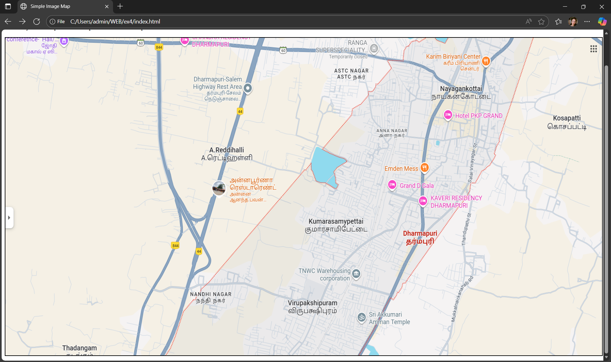
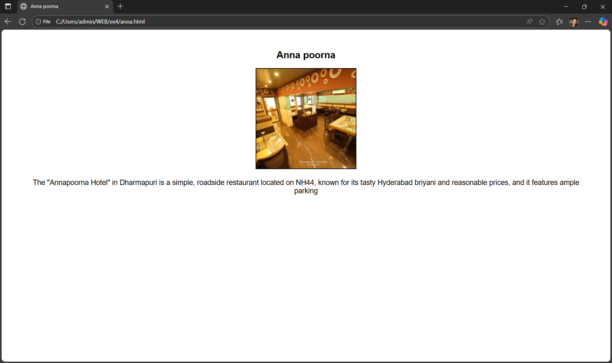
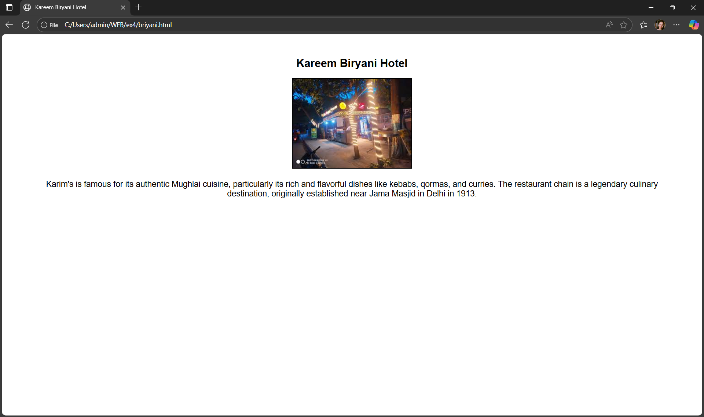
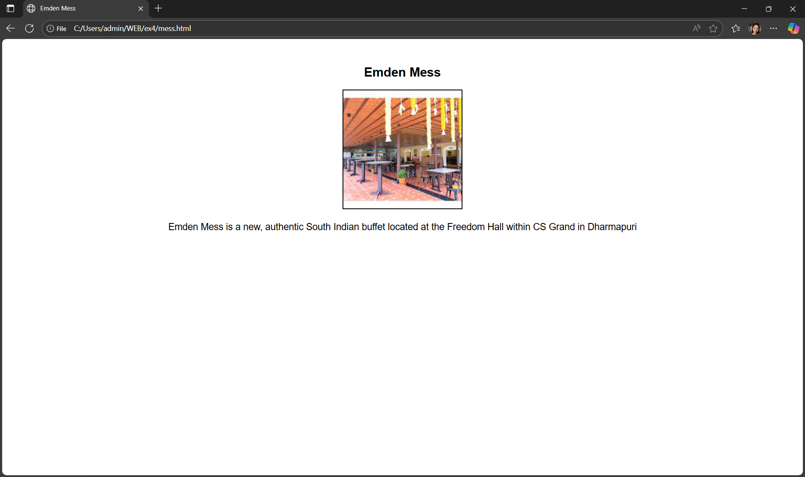

# Ex04 Places Around Me
## Date: 
13.11.2025
## AIM
To develop a website to display details about the places around my house.

## DESIGN STEPS

### STEP 1
Create a Django admin interface.

### STEP 2
Download your city map from Google.

### STEP 3
Using ```<map>``` tag name the map.

### STEP 4
Create clickable regions in the image using ```<area>``` tag.

### STEP 5
Write HTML programs for all the regions identified.

### STEP 6
Execute the programs and publish them.

## CODE
# INDEX.HTML
```
<!DOCTYPE html>
<html>
<head>
<title>Simple Image Map</title>
<meta name="viewport" content="width=device-width, initial-scale=1.0">
</head>
<body>
<h2>Clickable Map Example</h2>
<p>Click any marked spot on the map to know about the place.</p>

<!-- Lock the image size -->


<map name="map">
   

  <area  href="anna.html" coords="625,378,894,491" shape="rect">
  <area  href="mess.html" coords="1045,247,1400,463" shape="rect">
  <area href="kavari.html" coords="1309,386,1147,334" shape="rect">
  <area href="briyani.html" coords="1278,39,1552,133" shape="rect">


  
</map>

</body>
</html>
```
# ANNA.HTML
```
<!DOCTYPE html>
<html>
<head>
    <title>Anna poorna</title>
    <meta name="viewport" content="width=device-width, initial-scale=1.0">
    <style>
        body {
            text-align: center; /* centers content */
            font-family: Arial, sans-serif;
            margin: 50px;
        }
        img {
            max-width: 80%; /* keeps image responsive */
            height: auto;
            border: 2px solid black;
        }
        p {
            margin-top: 20px;
            font-size: 18px;
        }
    </style>
</head>
<body>
    <h2>Anna poorna</h2>

    <!-- Image of the place -->
    

    <!-- Description text -->
    <p>
        The "Annapoorna Hotel" in Dharmapuri is a simple, roadside restaurant located on NH44, known for its tasty Hyderabad briyani and reasonable prices, and it features ample parking
       
    </p>

</body>
</html>
```
# BRIYANI.HTML
```
<!DOCTYPE html>
<html>
<head>
    <title>Kareem Biryani Hotel</title>
    <meta name="viewport" content="width=device-width, initial-scale=1.0">
    <style>
        body {
            text-align: center; /* centers content */
            font-family: Arial, sans-serif;
            margin: 50px;
        }
        img {
            max-width: 80%; /* keeps image responsive */
            height: auto;
            border: 2px solid black;
        }
        p {
            margin-top: 20px;
            font-size: 18px;
        }
    </style>
</head>
<body>
    <h2>Kareem Biryani Hotel</h2>

    <!-- Image of the place -->
    

    <!-- Description text -->
    <p>
        Karim's is famous for its authentic Mughlai cuisine, particularly its rich and flavorful dishes like kebabs, qormas, and curries. The restaurant chain is a legendary culinary destination, originally established near Jama Masjid in Delhi in 1913.  
    </p>

</body>
</html>
```
# KAVERI.HTML
```
<!DOCTYPE html>
<html>
<head>
    <title>Kaveri Residency</title>
    <meta name="viewport" content="width=device-width, initial-scale=1.0">
    <style>
        body {
            text-align: center; /* centers content */
            font-family: Arial, sans-serif;
            margin: 50px;
        }
        img {
            max-width: 80%; /* keeps image responsive */
            height: auto;
            border: 2px solid black;
        }
        p {
            margin-top: 20px;
            font-size: 18px;
        }
    </style>
</head>
<body>
    <h2>Kaveri Residency</h2>

    <!-- Image of the place -->
    

    <!-- Description text -->
    <p>
        Kaveri Residency in Dharmapuri receives mixed reviews, with guests often praising the polite and helpful staff and convenient location near the bus stand and railway station
       
    </p>

</body>
</html>
```
# MESS.HTML
```

<!DOCTYPE html>
<html>
<head>
    <title>Emden Mess</title>
    <meta name="viewport" content="width=device-width, initial-scale=1.0">
    <style>
        body {
            text-align: center; /* centers content */
            font-family: Arial, sans-serif;
            margin: 50px;
        }
        img {
            max-width: 80%; /* keeps image responsive */
            height: auto;
            border: 2px solid black;
        }
        p {
            margin-top: 20px;
            font-size: 18px;
        }
    </style>
</head>
<body>
    <h2>Emden Mess</h2>

    <!-- Image of the place -->
    

    <!-- Description text -->
    <p>
        Emden Mess is a new, authentic South Indian buffet located at the Freedom Hall within CS Grand in Dharmapuri       
    </p>

</body>
</html>
```


## OUTPUT







## RESULT
The program for implementing image maps using HTML is executed successfully.
